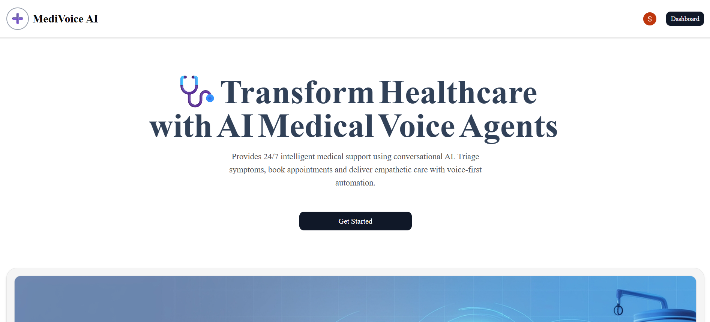
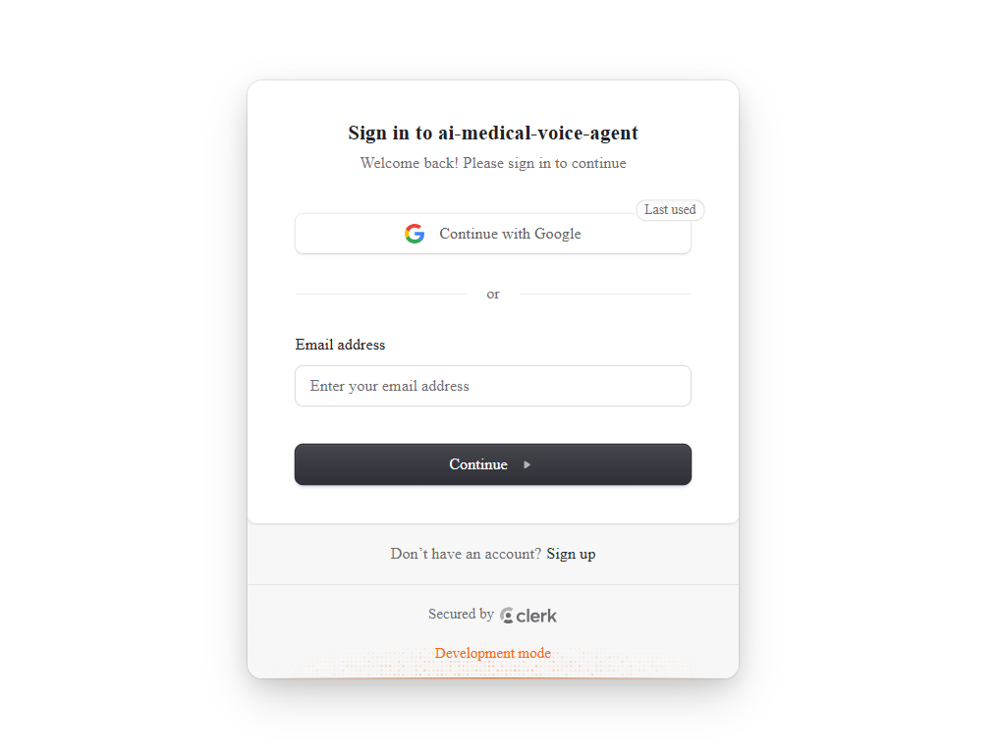
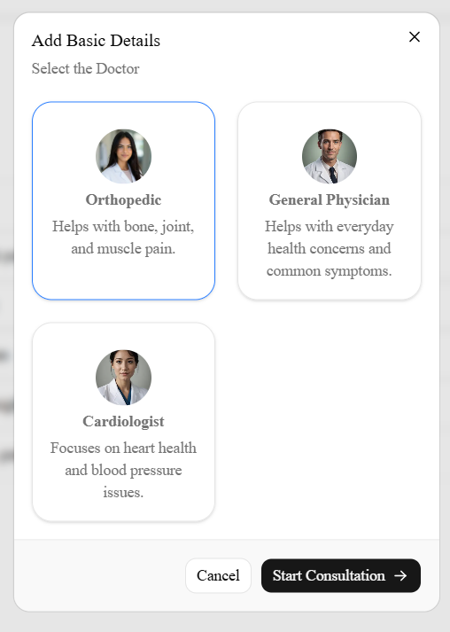
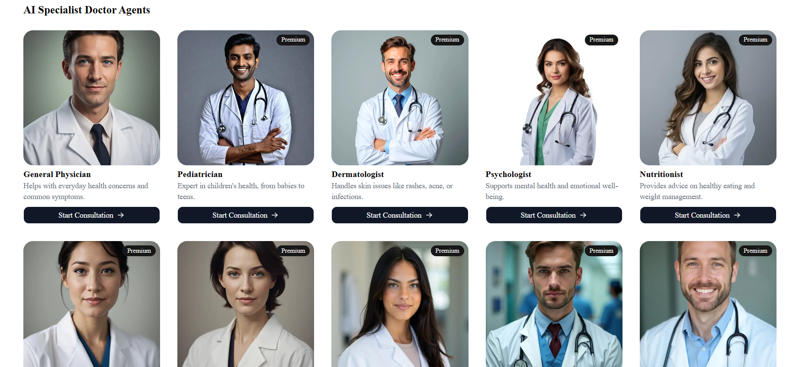
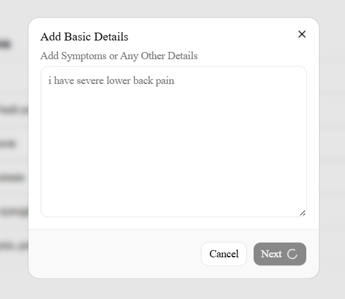
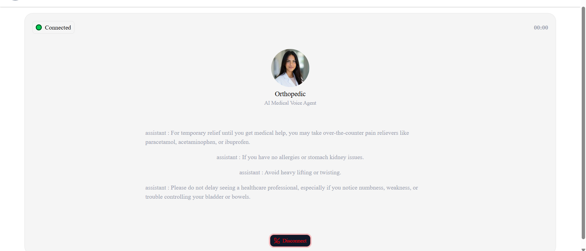
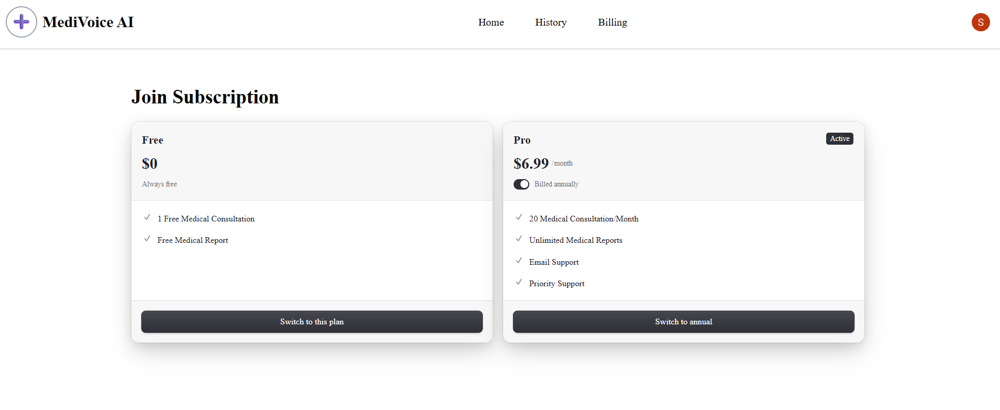
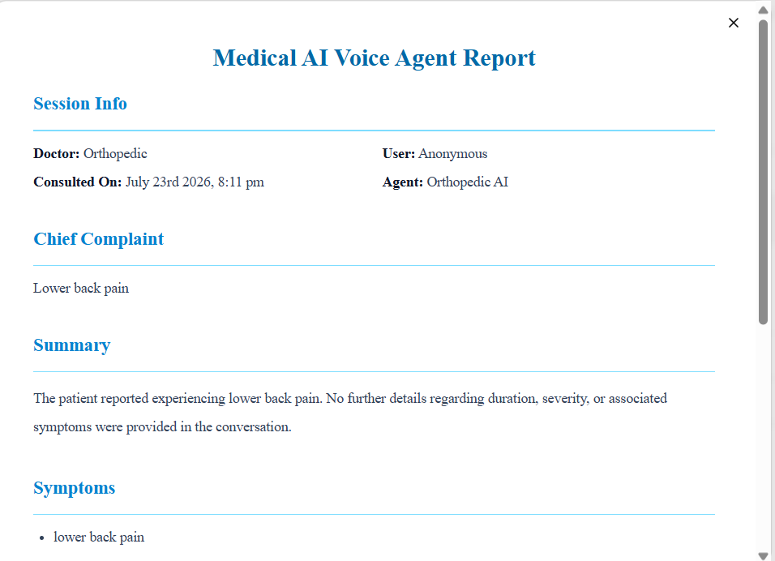
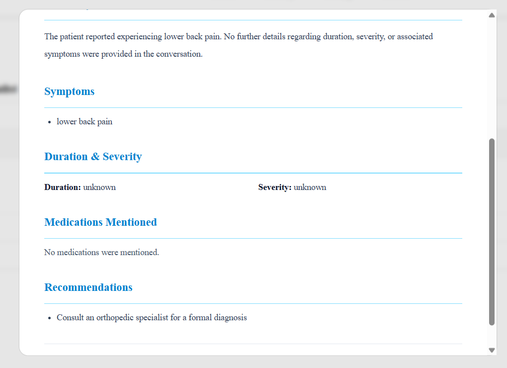

# 🩺 MediVoiceAI : AI Medical Voice Agent

An AI-powered medical voice assistant that enables users to have natural voice conversations with virtual doctors. The application uses AI to understand user symptoms, generate intelligent responses, and maintain conversation history.

## 🌐 Live Demo

🔗 **Live Application:** https://ai-medical-voice-agent-trju.vercel.app

## 📸 Application Walkthrough

### 1. Landing Page

The user is welcomed to the AI Medical Voice Agent and can begin the consultation process.



---

### 2. User Authentication

Secure sign-in powered by **Clerk Authentication**.



---

### 3. Dashboard

The dashboard provides quick access to previous consultations, credits, and available AI doctors.


---

### 4. Suggested Doctors

Based on the user's needs, the application suggests the most suitable AI doctors.



---

### 5. AI Doctors List

Browse all available AI doctor personas and choose the one you want to consult.



---

### 6. Symptoms Dialog

Describe your symptoms before starting the consultation.



---

### 7. Voice Consultation

Real-time AI-powered medical conversation using **Vapi** with responses generated by **Google Gemma** via **OpenRouter**.



---

### 8. Billing

Review consultation credits and billing details after the session.



---

### 9. AI Medical Report

The application generates a structured report summarizing the consultation.



---

### 10. AI Medical Report (Continued)

Additional recommendations and consultation details.



---

### 11. Consultation History

Access and review all previous AI medical consultations.


---

## ✨ Features

- 🔐 Secure authentication with Clerk
- 🎙️ AI-powered voice conversations
- 🤖 Multiple AI doctor personas
- 💬 Real-time medical consultations
- 📜 Consultation history
- 💾 Persistent database storage
- 📱 Responsive UI
- ⚡ Fast Next.js App Router architecture

---

## 🛠 Tech Stack

### Frontend
- Next.js 16
- React
- TypeScript
- Tailwind CSS
- shadcn/ui

### Backend
- Next.js API Routes
- Drizzle ORM
- Neon PostgreSQL

### Authentication
- Clerk

### AI Services
- Google Gemma
- Vapi AI
- AssemblyAI (Speech-to-Text)

### Deployment
- Vercel

---

## 🏗 Project Structure

```
app/
components/
context/
db/
lib/
public/
hooks/
```

---
## 🧠 How It Works

1. User signs in securely using Clerk.
2. Selects an AI doctor.
3. Starts a voice consultation.
4. Vapi streams voice conversation.
5. Gemini generates AI medical responses.
6. Session data is stored in Neon PostgreSQL.
7. Previous consultations can be viewed from History.

---

## 📂 Database

Built using **Drizzle ORM** with **Neon PostgreSQL**.

Main tables include:

- Users
- Sessions
- Consultation History

---

## 👩‍💻 Author

**Somili Das**

GitHub: https://github.com/SomiliDas


